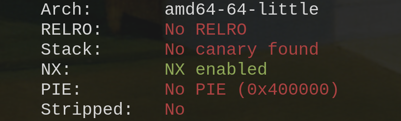
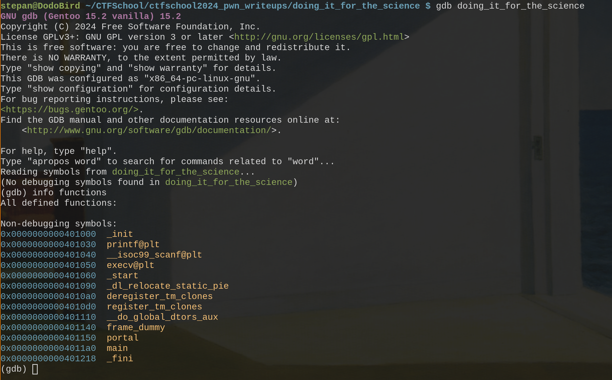
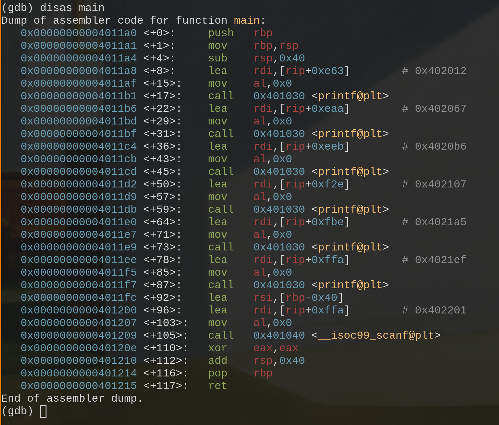
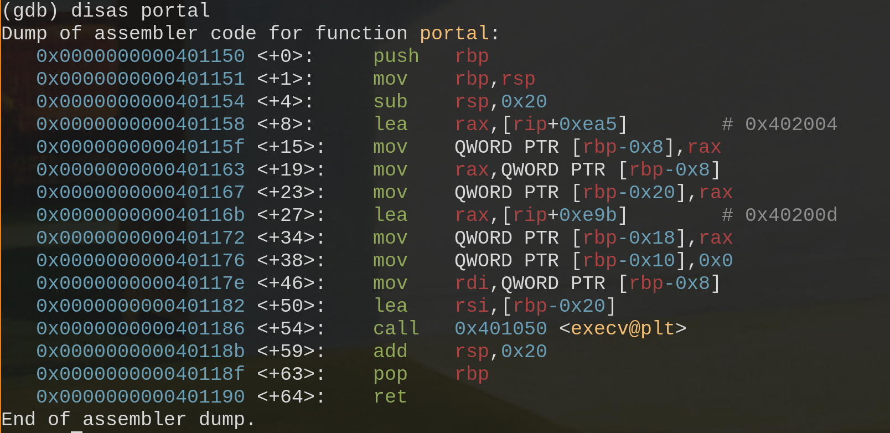
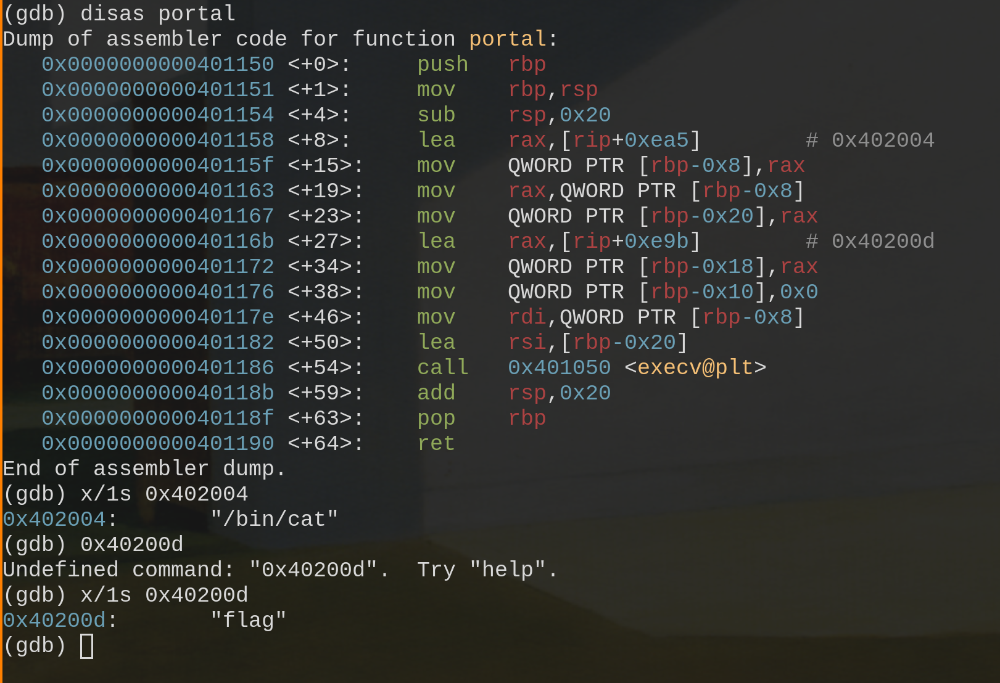
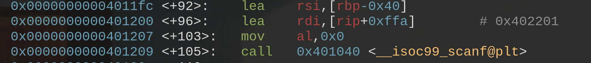
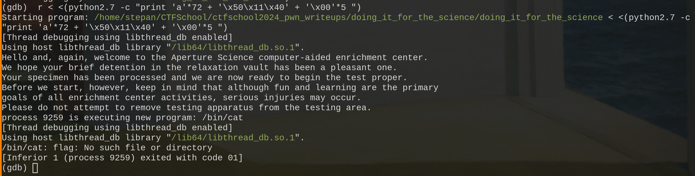
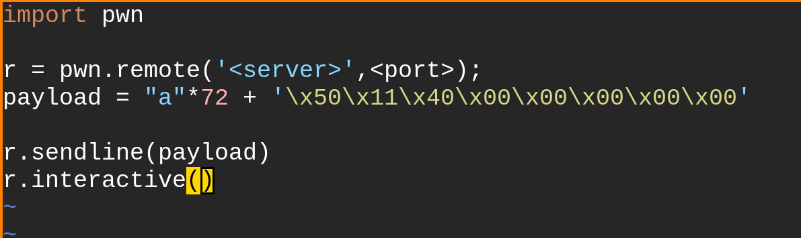

Проверим файл на средства защиты при помощи утилиты checksec:

Запустим gdb и посмотрим какие функции есть в программе

Увидим, что их всего две: main и portal. Изучим обе

Внутри функции portal можем увидеть вызов функции execve, в подобных задачах она, как правило (так же как и функция system), используется для вызова cat, которая выведет нам флаг. Можем проверить это, запустив программу и посмотрев значения строковых констант аргументов функции:

Это то, что нам надо.

Но, заметим, что main не вызывает portal, попасть в нее используя обычный ход программы невозможно, по результатм работы checksec также мы видим, что ни первая, ни вторая функция не содержат стековых канареек, а значит можно попробовать использовать buffer overflow для замены адреса возвращения.

Обратим внимание на scanf в мейне, мы можем использовать его для buffer overflow. 

В rdi передается первый аргумент scanf, то есть спецификатор(это можно понять по rip относительной адресации строковой константы, которая испоьзуется в 64-тибитных процессорах), а можно просто вывести ее значение во время исполнения в дебаггере. Второй аргумент, передающийся в rsi и есть строка, которую мы вводим. Она находится по адресу rbp-0x40. В 10-тичной системе исчисления 0x40 это 64 байта, не забудем, что выше адреса возвращения в стеке лежит сохраненное знчение rbp для предыдущего кадра стека, это еще 8 байт расстояния. Следовательно адрес возвращения лежит на расстоянии 72 байта от начала строки.

Осталось после 72 произвольных символов ввести адрес функции portal. А после подставим адрес(смещение) функции portal: 0x0000000000401150, только не забудем, что система использует little endian. Попробуем проэкспоутировать уязвимость в gdb. Запустим программу с вводом из python2.7 при помощи команды:

r < <(python2.7 -c "print 'a'*72 + '\x50\x11\x40' + '\x00'*5 ")

Поскольку мы запустили файл локально, файла с флагом тут нет, поэтому эксплуатируем уязвимость на удаленной машине.
Напишем эксплойт при помощи pwntools, подставив нужный сервер и порт.

И получим наш флаг: ctfschool{The_cAke_1s_A_liE_aNd_eVeRytTing_is_A_L1e............}

