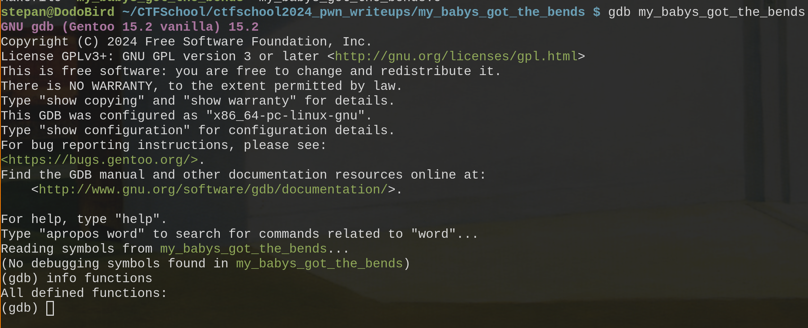
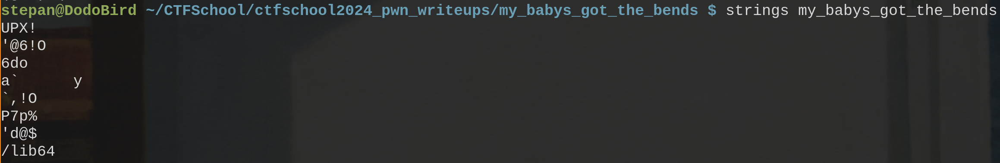
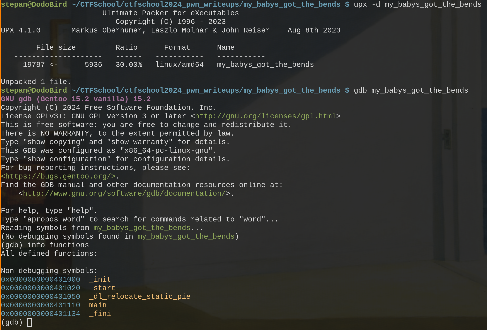
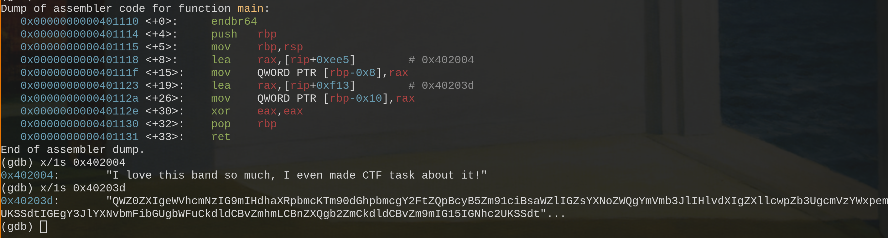
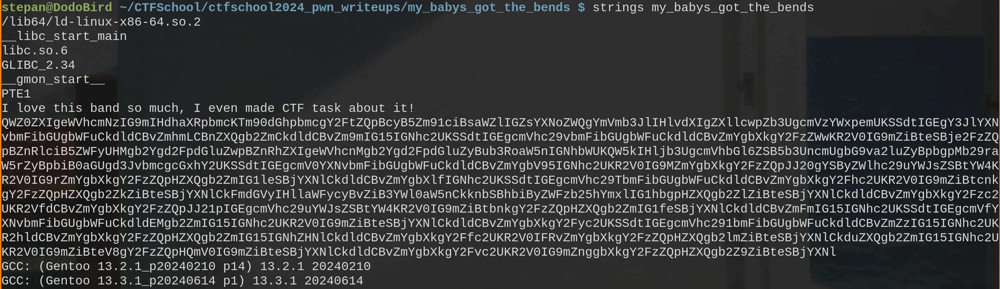
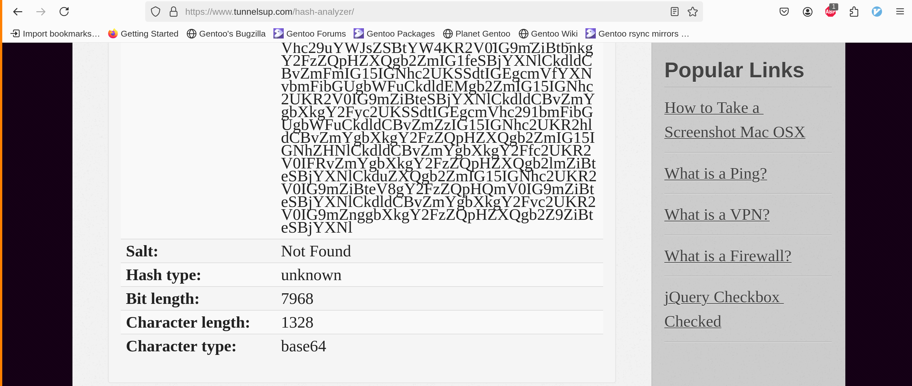
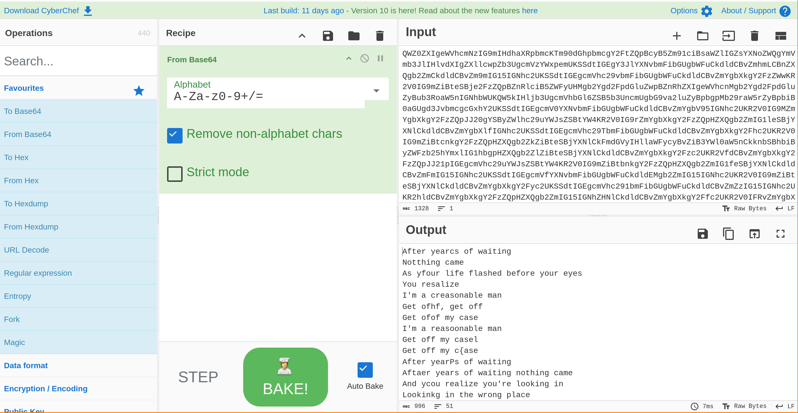

Попробуем открыть бинарный файл в дебаггере и посмотреть список функций.

Мы не получили никакого результата, такое случается если исполняемый файл был упакован при помощи упаковщика испольняемых файлов. Обычно, упаковщики оставляют полпись внутри файла, поищем эту подпись при помощи утилиты strings.

Увидим подпись UPX. Это значит что бинарный файл упакован при помощи UPX, распакуем файл и посмотрим, какие функции есть

Посмотрим внутрь функции мейн и увидим две строковые константы

Вывод в gdb может работать некорректно, поэтому опять используем утилиту strings на уже распакованный бинарный файл

Увидим Хэш, зайдем в интернет и определим, что этот base64 хэш

Зайдем на CyberChef и расшифруем хэш

Заметим, что каждая строчка в тексте содержит лишний символ, сложим из лишних символов наш флаг

ctfschool{Packt_Like_Sardines_in_a_Crushd_Tin_Box}