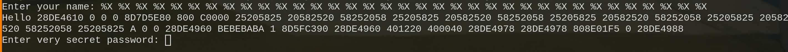
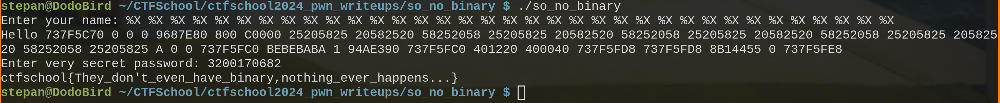

В этой задаче не предоставлен даже бинарный файл для разбора, программа просто крутится удаленно, поэтому механизмов решения немного. Единственная простая атака, которую мы можем использовать - это format string attack, с ее помощью мы сможем исследовать стек во время выполения программы. Введем в поле ввода спецификатор для шестнадцатиричных восьмибайтовых чисел %X:

BEBEBABA выбивается из общего ряда, скорее всего это и есть пароль, переведем в 10-тиричную систему счисления, получится 3200170682.  

Получим наш флаг: ctfschool{They_don't_even_have_binary,nothing_ever_happens...}