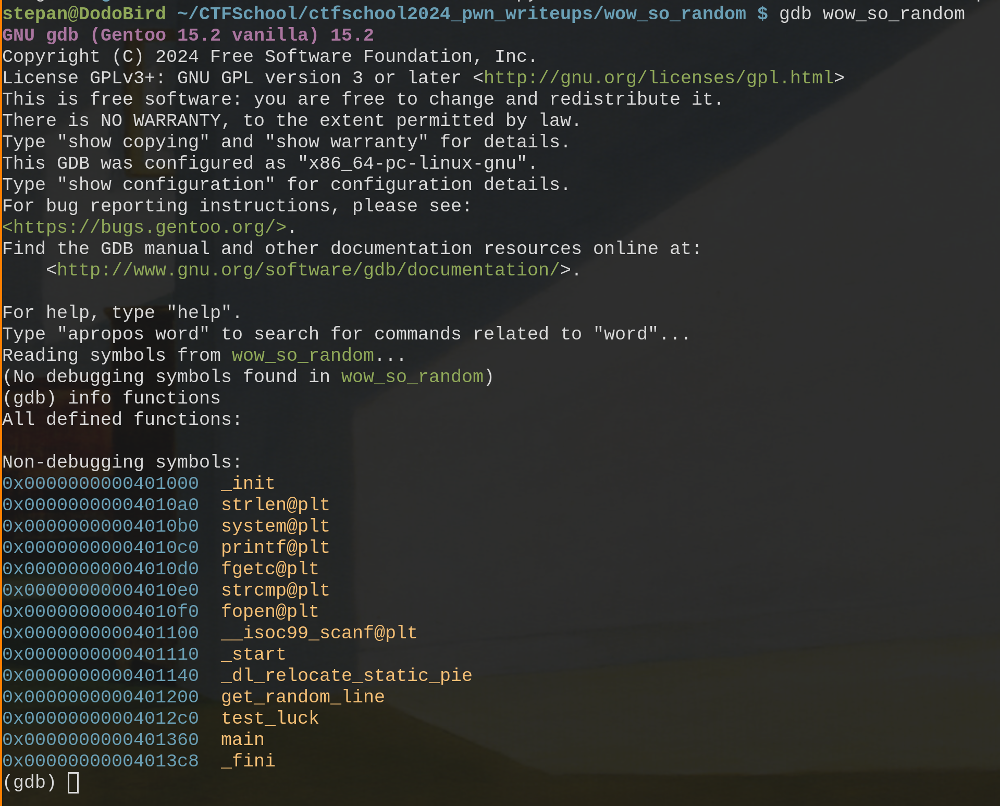
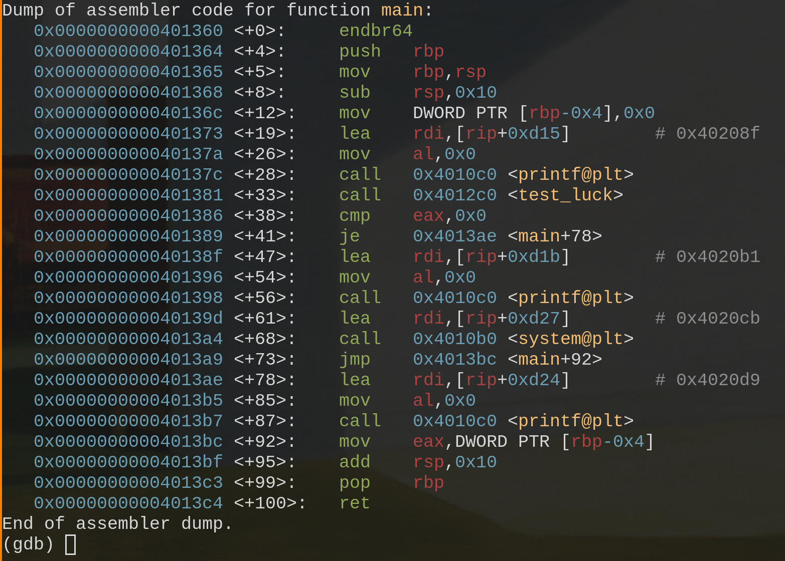
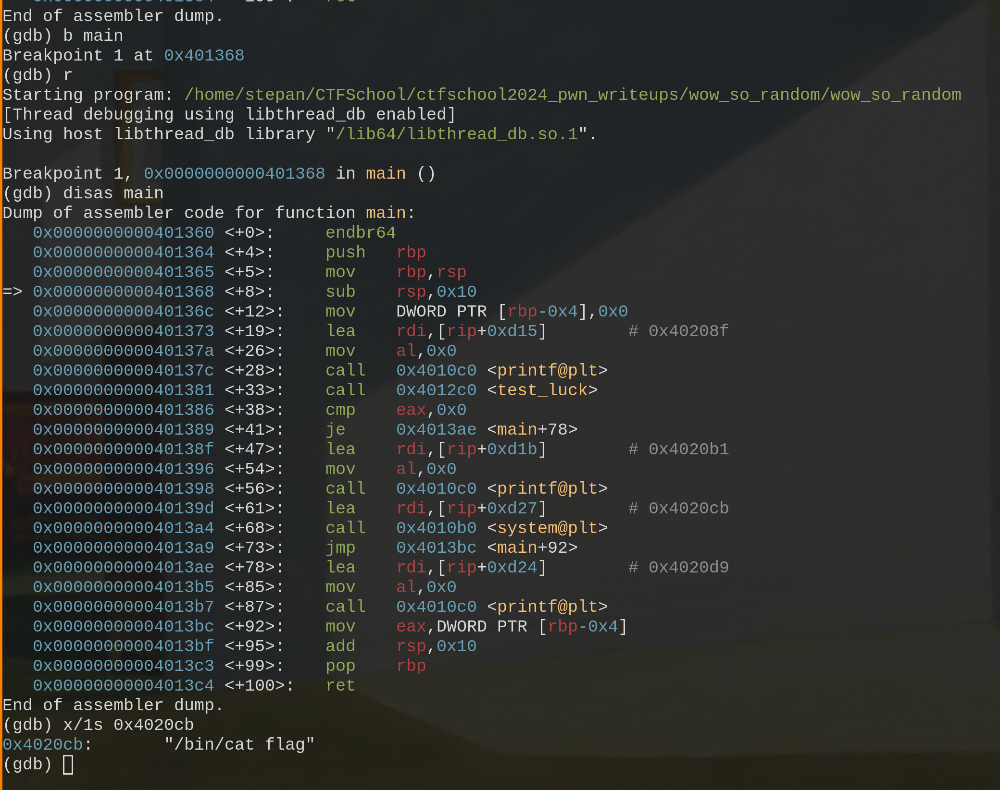
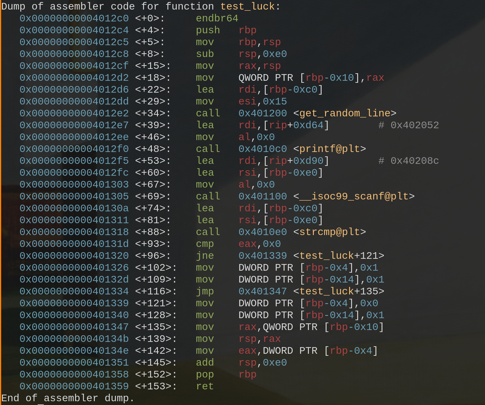
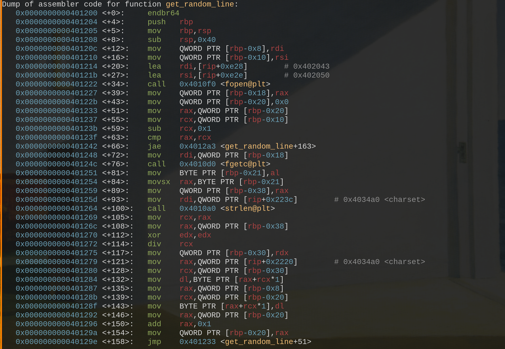
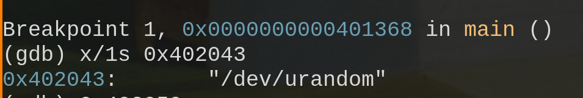
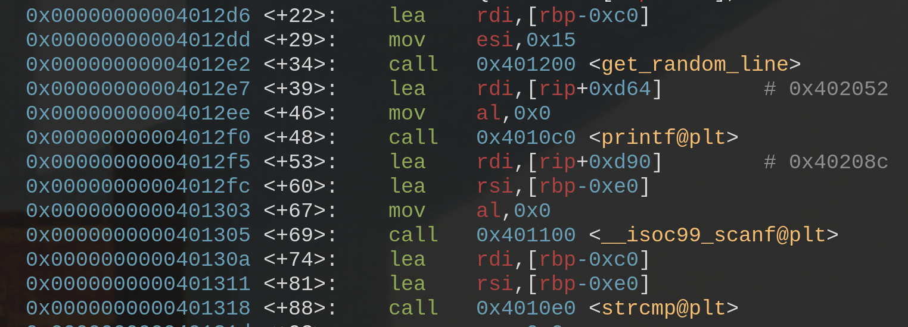
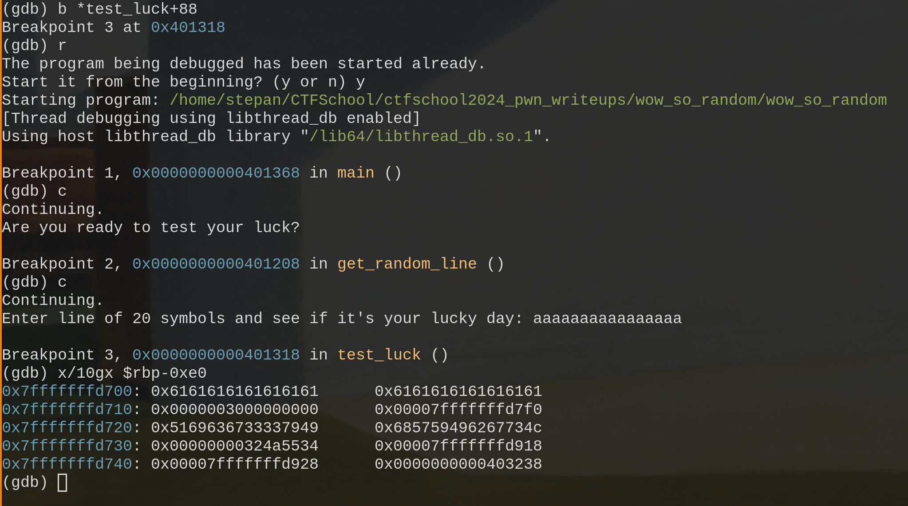
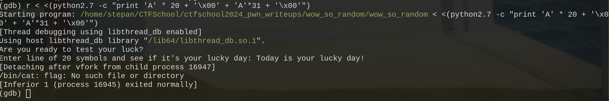
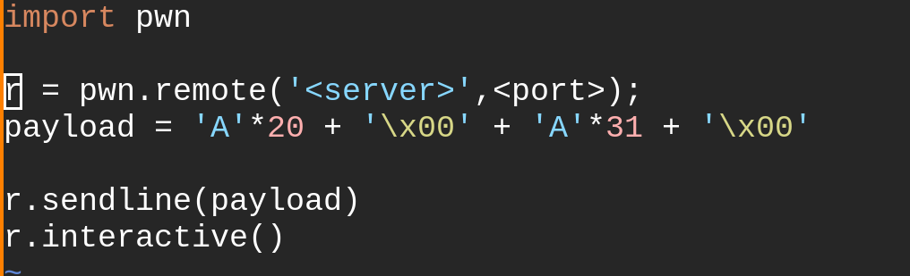

Откроем файл в gdb, посмотрим на функции, которые там есть, затем дизассемблируем main

Скорее всего нам нужен вызов функции system, которая выведет флаг, проверим наше предположение. Так как system принимает строковую константу(команду вывода флага) в качетсве аргумента, то мы сможем посмотреть что она делает.

Ее вызов то нам и нужен. 

Заметим, что функция test_luck возвращает некоторое значение (возврат значения из функции происходит при помощи регистра eax) и после регистр eax сравнивается с нулем на инструкции main+38, если test_luck вернула 0, то мы перепрыгиваем на main+78, пропуская вызов system, следовательно функция test_luck не должна вернуть 0. Исследуем теперь ее.

По работе функции можем понять, что программа хочет от нас строку, а внутри функции test_luck есть вызов strcmp, соответсвено она сравнивает нашу введенную строку с какой-то другой и если они одинаковы функция test_luck возвращает 1, а если разные 0. По названию функции get_random_line можно понять, что она возвращает случайную строку, с ней мы и сравниваем введенную, но насколько эта строка случайна? Изучим функцию get_random_line и посмотрим, что в ней.

Мы видим вызов fopen и вызов fgetc, значит строка откуда-то читатеся, посмотрим откуда. Поскольку fopen содержит название открываемого файла в строковой константе, то мы можем спокойно его вывести во время работы программы в дебаггере. Поставим брейк на произвольном месте и выведем эту строковую константу аргумент, которая предаются в rdi как аргумент fopen и лежит по адресу 0x402043.

Неутешительно, строка читается из /dev/urandom, это значит что она действительно случайная и нет никакого способа предугадать ее значение во время выполнения. Но может нам и не придется. Вернемся в test_luck

В строках test_luck+74 и test_luck+81 наши строки передаются как аругменты strcmp: rbp-0xe0 и rbp-0xc0. По строке test_luck+60 видим как в rsi передается адрес rbp-0xe0, это аргумент scanf, значит случайная строка лежит по адресу rbp-0xc0. 

Запустим программу с breakpoint на test_luck+81, то есть на strcmp и введем произвольную строку, а потом посмотрим на нее в стеке.

616161... по адресу 0x7fffffffd700 это наша строка, мы ввели символ 'a' несколько раз. Случайная строка лежит ниже в стеке, это значит что мы можем перетереть ее значение при помощи buffer overflow. Расстояние: 0xe0 - 0xc0 = 32 (в десятиричной). Случайная строка лежит по адресу 0x7fffffffd720. Если каждые две цифры шестнадцатиричного числа занимают один байт, то несложно посчитать, идя вниз, что длина случайной строки составляет 20 байт, а значит 20 символов. Не забудем, что strcmp понимает когда строка кончается по null байту, надо не забыть вставить его в наш payload.

Проэксплуатируем уявзимость локально в дебаггере при помощи команды:

r < <(python2.7 -c "print 'A' * 20 + '\x00' + 'A'*31 + '\x00'")

Флаг не вывело, потому что его нет, но все сработало, теперь напишем при помощи pwntools эксплойт

Наш флаг: 
ctfschool{I'm_sooo0o00o00o0oo_rand0m_I'm_so_qu1rky_I'm_so_c0000000l_You'll_never_know_my_next_move_hahahahaha}